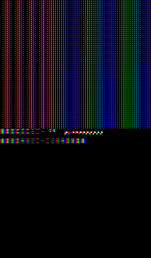

# MinecraftRGBDisplay

RGB Display Emulation that can be (theoretically) used in minecraft

I *have* used this display tech in minecraft, and it works [best on bedrock with a specific rgb pack](https://canary.discord.com/channels/841473212763734027/1251750480262991943/1251750480262991943) (join the [redstone army server to view the link](discord.gg/V5KFaF63mV)) with a raytraced pack so blacks are almost pure black, and the colors are clear, but the downside is that it has to be within render distance, and that is a small distance, anything further makes it look like every subpixel is on, so it doesnt work for anything big. The next best thing is without rtx but with the pack so you can view it at a far distance from the screen.

## usage

- change the filename in `og_image = Image.open("Images/newgradient.png")` to your filename and path
- run the file, you will get a 3x1 subpixel result (named `final_image_3x3.png`) and a 6x2 subpixel result (named `final_image_6x6.png`) and a simulated result (named `simulated_image.png`)

## notes

- ***larger images will take A LOT OF TIME*** because python is slow and because my code is not the best, but I made this intuitively, and made it as logically straightforward as possible. But, you could comment out whatever ones you dont wanna see of the 3 (3x3, 6x6, and sim) to save time
- The both the 3x3 and 6x6 versions have 1 pixel between them, but because the 6x6 is larger relative to the gap, you will see the color pops more than the 3x3 version
- the simulated image does NOT account for the gaps between pixels, so itll always look brighter than the 3x3 and 6x6 versions of the image. (I might add another version that includes the border, but in the end itll be the same size as the 3x3 or 6x6 versions)
- there is a schem file that you can run, but it might be flipped when you paste in the schematic, also **PLEASE** change the directory because it works for me but it might not work for you!

Testing image to get a feel of how it would work and look:

